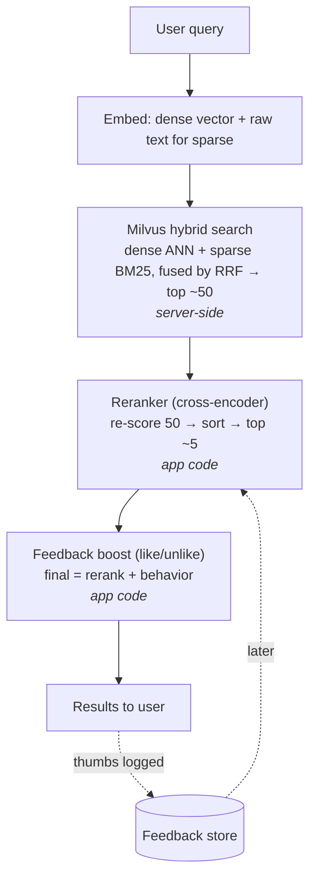

# Architecture

System map for vector-search-demo: the major components, how they talk to each other,
and where data lives. The documentor maintains the auto-managed region below;
discuss changes with it via the documentor command.

## Search relevance pipeline

### The problem

Naive top-k vector search returns the passages whose embeddings are *closest* to the
query embedding. "Closest" is not the same as "best": the semantically nearest passage
is often not the one that actually answers the question, and users phrase queries with
different words than the documents use. There is no single knob that fixes this — the
solution is a **multi-stage pipeline** where each stage corrects a weakness of the one
before it.

### Pipeline overview

The pipeline, stage by stage:

| Order | Stage | Runs |
|---|---|---|
| 1 | Embed query (dense) + raw text (sparse) | app code |
| 2 | Milvus hybrid search + RRF fusion → top ~50 | server-side |
| 3 | Cross-encoder reranker → top ~5 | app code |
| 4 | Feedback boost (like/unlike) | app code |
| → | Thumbs logged, used later to fine-tune the reranker | offline |

Mental model: **stages 1–2 = recall** (don't miss the right doc, cheap, in Milvus),
**stage 3 = precision** (put the truly-best on top, smart, in app code),
**stage 4 = personalization** (learn what *our* users actually like, behavioral).

### Stage 1 — Dense vs. sparse embeddings

Text is turned into vectors two complementary ways:

- **Dense** captures *meaning*. A neural model outputs a few hundred numbers (all
  filled in) representing the concept. "reset my password" and "forgot my login
  credentials" land near each other despite sharing no words. Strength: synonyms and
  paraphrase. Weakness: blurs exact tokens (IDs, names, "error 4012").
- **Sparse (BM25)** captures *keywords*. Conceptually one slot per word in the
  vocabulary, almost all zero except the words present — classic keyword search as a
  vector. Strength: exact terms, codes, jargon. Weakness: misses synonyms entirely.

Milvus 2.4+ can auto-generate the sparse/BM25 vector from the raw text field via a
built-in `Function`, so you typically only supply the dense vector yourself.

### Stage 2 — Hybrid search + RRF fusion

Run both searches and merge them. The two scores are on different scales (cosine
distance vs. BM25), so they can't simply be added. **Reciprocal Rank Fusion (RRF)**
ignores raw scores and combines by *position*: each doc scores `1 / (k + rank)` in
each list, summed. A doc that ranks decently in *both* beats a doc that ranks #1 in
only one — agreement wins. This is fully server-side in a single `hybrid_search` call;
choose `RRFRanker()` (rank-based) or `WeightedRanker(a, b)` to trust one source more.
This is the **recall** layer.

### Stage 3 — Cross-encoder reranker

Retrieval embeds each passage *alone, ahead of time*, then just measures distance —
fast but it never "reads" the query and passage together. A **cross-encoder reranker**
feeds the query and one passage into a model *as a pair* and outputs a single
relevance score; you sort by it and keep the top-n. It catches "does this actually
answer the question?" that distance misses.

Key facts:

- **Off-the-shelf, no training required** (e.g. `BAAI/bge-reranker-v2-m3`). It learned
  the general skill of judging relevance, so it works on docs it has never seen.
- **Slow** — one model run per candidate — so it only runs on the shortlist from
  stage 2, never the whole corpus.
- It runs in **your application code**, not inside Milvus. (Milvus's `RRFRanker` /
  `WeightedRanker` are *fusion* rerankers; a cross-encoder is a *model* reranker.)

This is the **precision** layer and usually the single biggest quality jump.

### Stage 4 — User feedback (like/unlike)

Stages 1–3 are content-only; they don't know which results users found helpful. A
like/unlike button captures **explicit relevance feedback**, added in three tiers:

- **4a — score boost (no ML):** store `(query, passage_id, +1/-1)` and nudge the final
  score, e.g. `final = rerank_score + w * (likes - dislikes)`. Attach feedback to the
  **passage** and match it via the **query embedding** (not the literal string) so a
  like on "forgot login" also helps the near query "can't access my account."
- **4b — fine-tune the reranker:** thumbs become labeled pairs (like = relevant,
  unlike = not) to specialize the reranker to your docs and users.
- **4c — learning-to-rank:** train a model that blends all signals (dense, sparse,
  rerank score, like ratio, recency) into the final order.

This is the **personalization** layer.

#### How much feedback data is worth it

| Tier | What you do | Worth it at | Why |
|---|---|---|---|
| 4a boost | re-score nudge | ~tens of thumbs total; 2-3 per passage | not a model — a direct lookup; effectively no minimum |
| 4b fine-tune | retrain the reranker | ~1k-5k labeled pairs (sweet spot ~10k+) | below ~1k usually *hurts* the off-the-shelf model |
| 4c learning-to-rank | blend all signals | ~50k+ interactions | more features need more data to beat noise |

Coverage matters more than raw count: feedback spread across **hundreds of distinct
queries** with **both likes and dislikes** beats thousands of thumbs on a handful of
queries. Assume only ~5-15% of users ever click a thumb. Rough timeline: at
~50 searches/day, 4a is useful in days and 4b likely never pays off; at ~5,000+/day,
4a helps day one and 4b becomes worthwhile in weeks.

### Pros & cons by stage

| Stage | Pros | Cons | When to add |
|---|---|---|---|
| Dense embedding | matches different words, same intent | blurs exact terms; needs an embed model | always — the foundation |
| Sparse / BM25 | nails exact terms/IDs/jargon; Milvus auto-generates it | misses synonyms; useless alone | always — pairs with dense |
| Hybrid + RRF | best of both; fully in Milvus, one call; no scale tuning | rank-based, not "smart"; can't tell which doc truly answers | always — free with the two fields |
| Cross-encoder reranker | biggest quality jump; off-the-shelf; handles different words/docs | slow (per-candidate); adds latency/compute | early — highest ROI after hybrid |
| Feedback boost (4a) | captures real user value; no ML; ships in a day | cold start; naive boost can be noisy/gamed | ship button day 1, enable once data trickles in |
| Fine-tune reranker (4b) | specializes to your docs & users | needs label volume + ML pipeline & upkeep | phase 2, once thousands of thumbs exist |
| Learning-to-rank (4c) | squeezes out max quality | most complex; overkill for most apps | only at large scale |

### Recommended roadmap

- **MVP:** stages 1 + 2. Hybrid search alone lives entirely in Milvus and is already
  solid.
- **Quality:** add stage 3 (reranker) — biggest single win, no training, a few lines
  of app code.
- **Compounding:** ship the like/unlike button immediately to *collect* data, switch
  on the 4a boost soon after, and only reach for 4b/4c if the off-the-shelf reranker is
  measurably letting you down. Many strong production systems never fine-tune.

<!-- Anything above this line is hand-maintained. -->

<!-- AUTO:architecture START -->
<!-- The documentor manages everything between these markers. Do not edit by hand. -->

_No architecture recorded yet. The documentor populates this after the next
sprint that touches structure._

<!-- AUTO:architecture END -->
